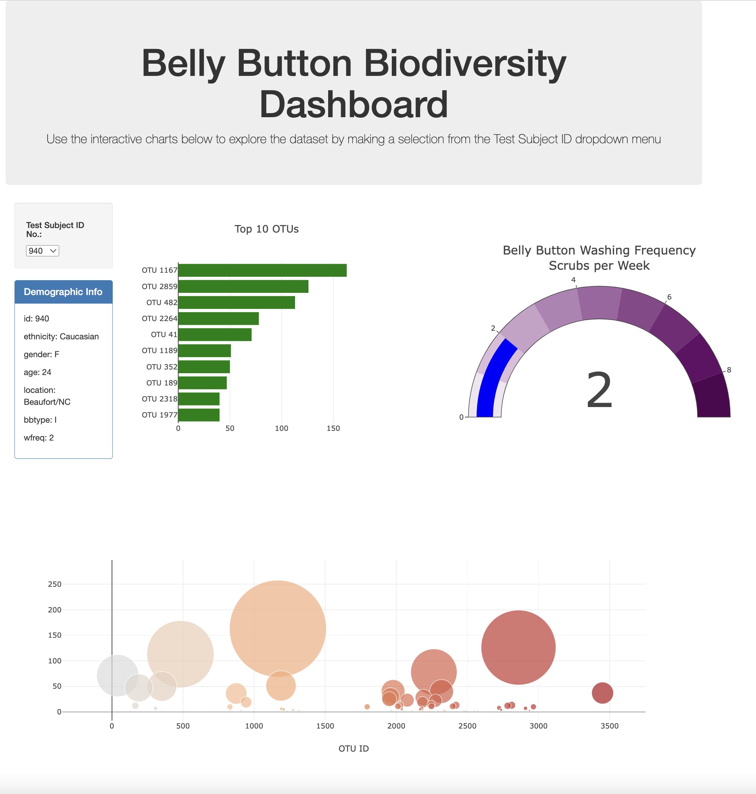

# belly-button-challenge
 

A project that uses JavaScript with HTML and Plotly to build an interactive dashboard for exploring a dataset which catalogs the microbes that colonize human navels.
 
 
Click this link for deployment: https://terrysimbar.github.io/belly-button-challenge/
 
   

## Table of Contents
#### Introduction
#### Features
#### Requirements & Dependencies
#### Project Structure
#### Usage
#### Contributing
#### License
 

#### Introduction
This JavaScript project uses D3 to read in a JSON data file from a URL and create an interactive dashboard on a webpage. The dashboard allows users to select a test subject ID number from a dropdown menu and view charts/graphs about the selected test subject.

#### Features
- Use D3 to read in a JSON data file from a URL.

- Create a dropdown menu using 'select', 'append', 'text', and 'OptionChanged' functions.

- Use arrow function to match each sample and its metadata into a single object to be visualized in the dashboard when the user selects a test subject ID number from the dropdown menu.    

- Use PlotLy to create a horizontal bar chart, a bubble chart, and a gauge chart to visualize the data for the selected test subject ID number. 

 

#### Requirements & Dependencies
This project does not use external dependencies managed through npm or yarn. Instead, all the necessary JavaScript libraries, including D3.js and Plotly.js, are included directly in the accompanying HTML file using `<script>` tags. These libraries are either hosted via Content Delivery Networks (CDNs) or included locally.
 

---
## Project Structure
 

#### HTML Setup
The HTML file (`index.html`) in this project is structured as follows:

1. **Document Type Declaration** `<!DOCTYPE html>` defines the document type and version of HTML being used.

2. **Head Section** `<head>` contains meta information about the document, such as character encoding, viewport settings, and the page title.

3. **Bootstrap Styling** `<link rel="stylesheet">` is a popular CSS framework that is linked in the `<head>` section to provide styling for the webpage.

4. **Body Section** `<body>` contains the main content of the webpage, including the dashboard elements.

5. **Dashboard Structure**: The interactive dashboard is structured within the `<body>`, as follows:
   - **Jumbotron**: A prominent section at the top of the page containing the project title and a brief description.
   - **Test Subject ID Dropdown**: A dropdown menu `<select>` allows users to select a test subject ID, and display the corresponding charts and graphs.    
   - **Demographic Info Panel**: A panel displaying demographic information related to the selected test subject.
   - **Chart Sections**: Three sections for displaying charts and graphs:
     - Horizontal Bar Chart
     - Gauge Chart
     - Bubble Chart

6. **JavaScript Files** JavaScript files are included at the end of the `<body>` to handle interactivity and data visualization. The included libraries are D3.js and Plotly.js, which are loaded via CDN, and `app.js`, which contains custom code for the project.

Please refer to the accompanying `index.html` file for the complete code.
 

#### JavaScript Setup
The `app.js` file is used to create and update the interactive charts and graphs on the Belly Button Biodiversity Dashboard. Here's an overview of its key functionalities:

1. **Define the URL for JSON Data**: The `const url` variable is used to store the URL of the JSON data containing the dataset. This data is loaded and used to populate the dropdown menu and update the charts.

- As an alternative to using a URL, You can also use D3 to read the dataset using the `samples.json` file in this repository. To do so, you would need to replace the `const url` variable with the following code:

`d3.json('your-local-file.json').then(...`

2. **Create the Dropdown Menu**: The `d3.json(url)` function is used to read the JSON data and create the dropdown menu `<select>` based on the test subject IDs `names`. Each test subject ID is added as an option to the dropdown menu.

3. **`optionChanged` Function** is called when a new test subject ID is selected from the dropdown menu. It retrieves the selected data for the chosen test subject, including sample values, OTU IDs, and metadata.

4. **Update Metadata**: The metadata for the selected test subject is displayed in the "Demographic Info" panel. The function clears any previous metadata and appends new key-value pairs from the metadata object.

5. **Horizontal Bar Chart** is created using Plotly, displaying the top 10 OTUs (Operational Taxonomic Units) for the selected test subject. The chart's data includes sample values, OTU IDs, and labels.

6. **Bubble Chart** is created using Plotly, visualizing the distribution of OTU IDs and sample values. The size and color of the bubbles are based on the sample values and OTU IDs.

7. **Gauge Chart** is created as an indicator gauge using Plotly, with a color-coded range indicating the belly button washing frequency.

9. **Integration with HTML**: Each chart is integrated into the HTML file by using `Plotly.newPlot` to render them in specific HTML div elements with corresponding IDs.

For the complete code and detailed implementation, please refer to the `app.js` file in this project.
 

---
#### Usage
1. Ensure that you have all the necessary files/links/scripts. 
2. Load the project files in an appropriate code editor such as Jupyter Notebook. 
3. Copy the HTML File path and paste it in your browser to view the dashboard.

#### Contributions
Contributions to this project are highly encouraged! If you wish to contribute, please follow these guidelines:

- Fork the belly-button-challenge repository and clone it locally.
- Create a new branch for your feature or bug fix.
- Commit your changes with descriptive commit messages.
- Push your branch to your forked repository.
- Submit a pull request to the original repository.
- Please ensure that your code adheres to the project's coding style and conventions.

If you encounter any issues or have suggestions for improvements, please open an issue on the GitHub repository.

### License
These projects are licensed under the MIT License. Feel free to use, modify, and distribute the code as per the terms of the license. 